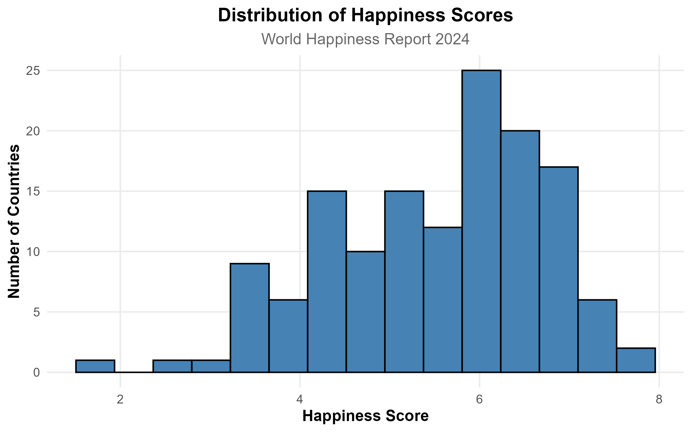
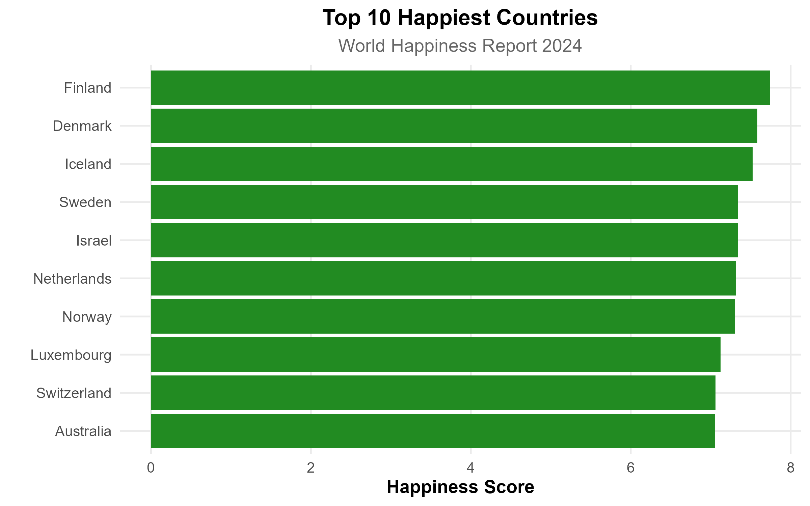
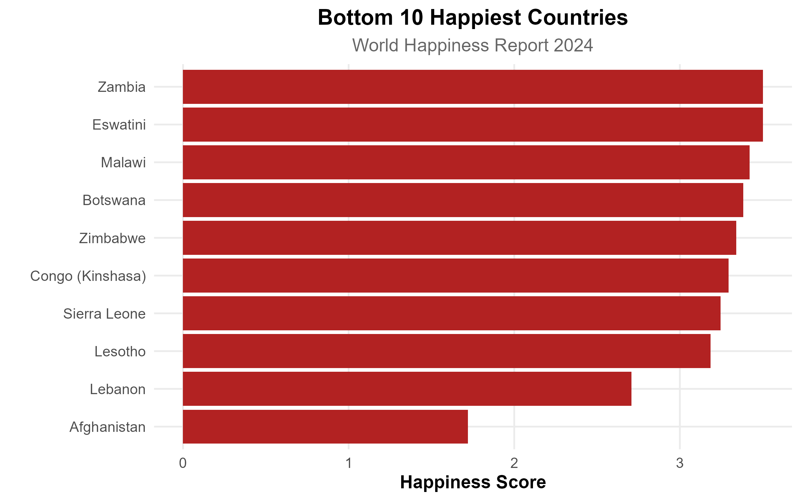
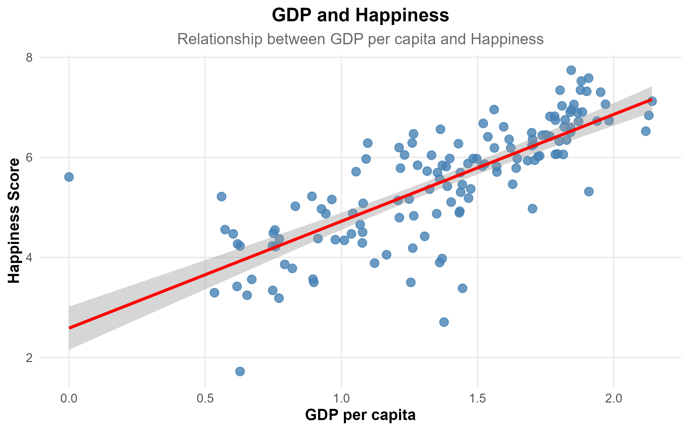
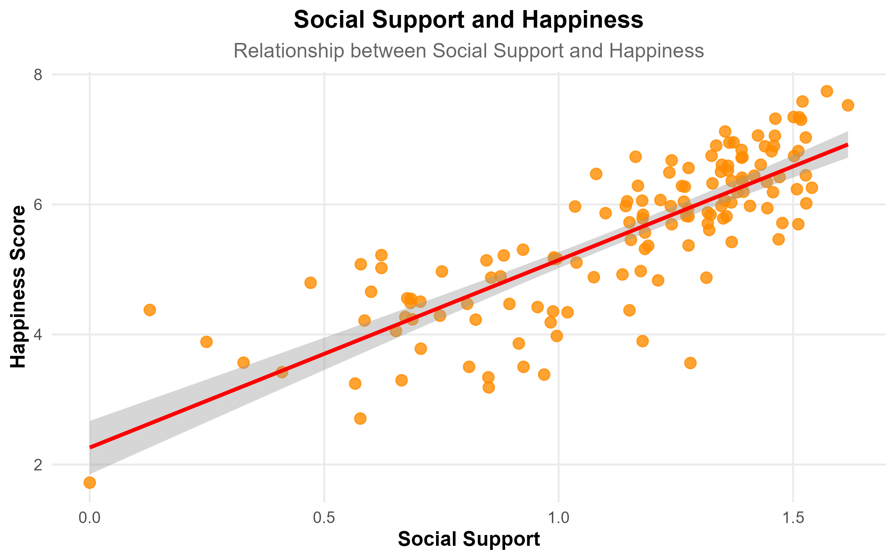
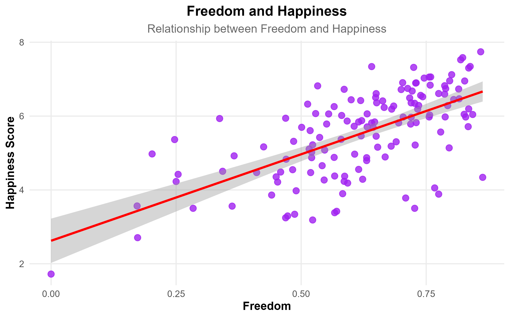
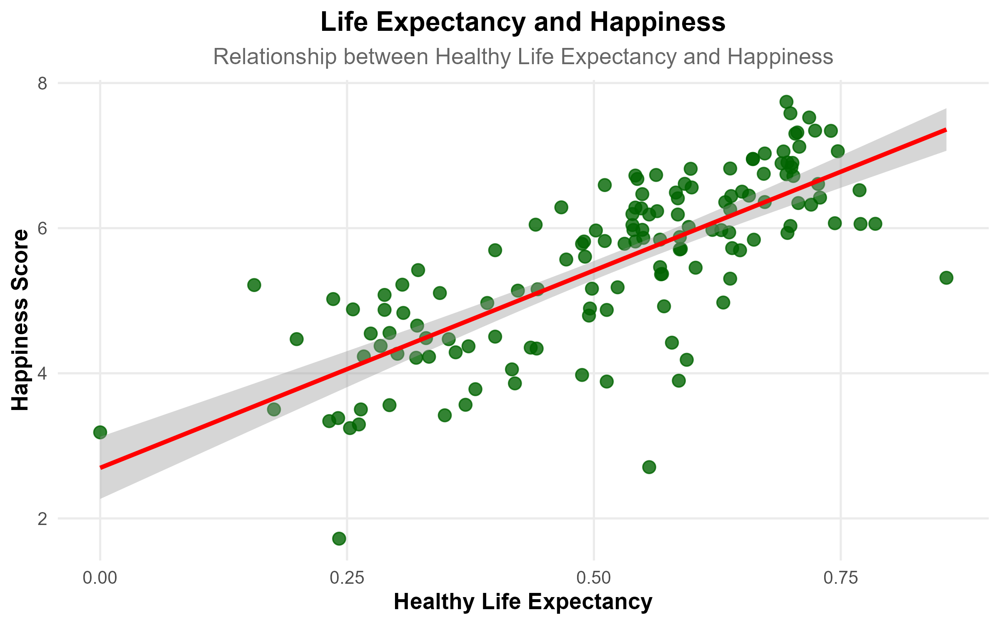
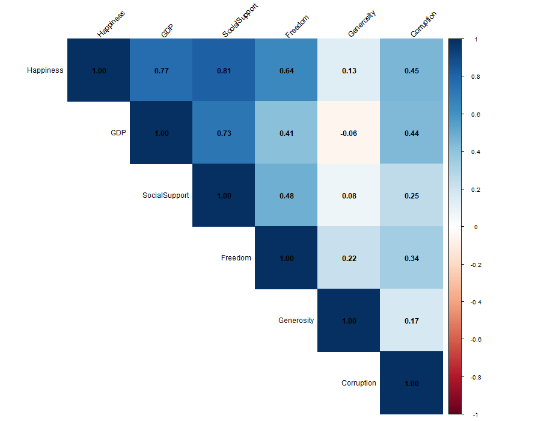

# World Happiness Analysis using R
An economics research project that explores the socioeconomic determinants of happiness across countries using the **World Happiness Report 2024** dataset. The analysis applies data cleaning, exploratory data analysis (EDA), visualization, correlation analysis, and multiple linear regression to examine how economic and social indicators influence happiness levels.

## Project Overview
The World Happiness Report ranks countries based on people's self-reported life evaluations while considering several socio-economic factors. This project investigates how variables such as GDP, social security, healthy life expectancy, freedom, generosity, and perceptions of corruption contribute to happiness across countries.
The analysis was conducted entirely in **R** using modern data analysis packages from the **tidyverse** ecosystem.

## Research Objective
The primary objective of this project is to examine the relationship between happiness and key socioeconomic indicators across countries.
Specifically, this project aims to:
- Clean and prepare the World Happiness Report dataset.
- Explore the distribution pf happiness scores.
- Identify the happiest and least happy countries.
- Study relationships between happiness and socioeconomic variables.
- Perform correlation analysis.
- Build a Multiple linear regression model.
- Interpret the statistical significance of each determinant.

## Dataset
**Source:** World Happiness Report 2024
The dataset contains country-level information on:
- Happiness scores
- GDP per capita
- Social Support
- Health Life Expectancy
- Freedom to make life choices
- Generosity
- Perceptions of Corruption
After data cleaning, the final dataset consisted of **140 countries**.

## Methodology
The project follows a complete data analysis workflow:

### 1. Data Import
- Imported CSV dataset into R

### 2. Data Cleaning
- Checked missing values
- Removed incomplete observations
- Checked duplicate records
- Renamed variables
- Removed unnecessary columns

### 3. Exploratory Data Analysis
- Summary statistics
- Distribution of happiness scores
- Top 10 happiest countries
- Bottom 10 happiest countries

### 4. Data Visualization
Scatter plots with regression lines were created to examine relationships between:
- GDP and Happiness
- Social Support and Happiness
- Freedom and Happiness
- Life Expectancy and Happiness

### 5. Correlation Analysis
A correlation matrix was generated to examine relationships among all exploratory variables.

### 6. Multiple Linear Regression
A multiple linear regression model was estimated using:
Happiness ~ GDP + SocialSupport + LifeExpectancy + Freedom + Generosity + Corruption

### 7. Model Diagnostics
Regression assumptions were evaluated using:
- Residual vs Fitted plot
- Histogram of Residuals
- Normal Q-Q plot

# Key Findings
The regression model explained approximately **82% of the variation in happiness scores (R² ≈ 0.82)**.

Major findings include:

- **Social Support** is one of the strongest predictors of happiness.
- **Freedom to Make Life Choices** has a substantial positive relationship with happiness.
- **GDP per Capita** remains statistically significant after controlling for other variables.
- **Healthy Life Expectancy** contributes positively to national happiness.
- **Generosity** was not statistically significant in the final model.
- Overall, the regression model provides a strong fit for explaining cross-country differences in happiness.

# Visualizations'
## Distribution of Happiness Scores

## Top 10 happiest countries

## Bottom 10 happiest countries

## GDP vs Happiness

## Social support vs Happiness

## Freedom vs Happiness

## Life expectancy vs Happiness

## Correlation Heatmap

# Technologies used
- R
- tidyverse
- tidyr
- dplyr
- ggplot2
- readr
- corrplot

# Future Improvements
Potential extensions of this project include:
- Building panel data models using multiple years of the World Happiness Report.
- Applying machine learning algorithms to predict happiness scores.
- Comparing results across regions and income groups.
- Investigating causal relationships using econometric techniques.

## Author
**Manasvi Sunil Jadhav**
M.Sc. Economics (Data Analytics)
Symbiosis School of Economics
